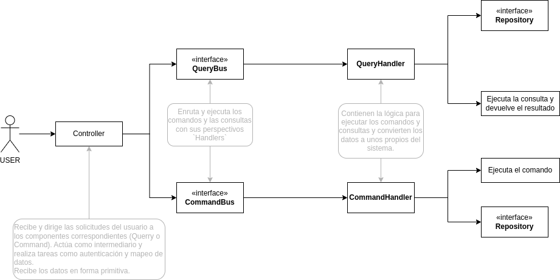

# Patrón CQRS (Command Query Responsibility Segregation)

El patrón CQRS nos permite separar las operaciones de escritura (comandos) de las operaciones de lectura (consultas).

- Comandos (Commands):
    - Representa una acción a realizar y nunca deben de devolver un valor. En Java pueden devolver **Futuros** en caso de que el comando
      pueda ser **asíncrono**. En otros lenguajes puede devolver su respectivo **futuro** como pueden ser las **promesas** en JavaScript.
    - Ejemplo: `CastSpellCommand`.
- Consultas (Queries):
    - Representan una búsqueda.
    - Ejemplo: `FindWizardQuery`.
- Buses de Comandos y Consultas:
    - Se encargan de enrutamiento y ejecución de los comandos y consultas utilizando sus respectivos "handlers".
    - Mantienen un diccionario que asocia cada comando o consulta con su correspondiente `handler`.
- Controladores (Controllers):
    - Reciben las solicitudes del cliente con datos primitivos y coordinan la ejecución de comandos y consultas.
    - Validan y mapean los datos de entrada proporcionados por el cliente para asegurar que sean válidos para el sistema.
    - Llaman al bus de comandos o consultas correspondiente y gestionan las respuestas.
    - Contiene la lógica para ejecutar un commando/consulta de forma asíncrona o síncrona.
- Handlers:
    - Contienen la lógica para ejecutar los comandos y consultas.
    - Transforman los datos primitivos en formatos reconocidos por el sistema.

En resumen, CQRS propone separar las operaciones de lectura y escritura en un sistema mediante el uso de comandos y consultas. Los
controladores reciben las solicitudes del cliente, los buses las enrutan a los handlers correspondientes, quienes ejecutan las acciones
necesarias en el modelo de dominio o en el lado de lectura. Esto permite un diseño más eficiente y escalable, optimizando el rendimiento de
las consultas y facilitando la evolución independiente de cada lado del sistema.